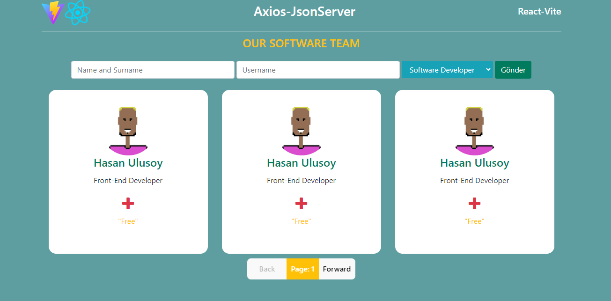

# Our Team
-Takım oluşturma, 
-Takım üyesine görev verme görevi sonlandırma
-Takım üyesinin bilgilerini güncelleme,
- Takım üyesini silme gibi yapıların olduğu axios-json server çalışmasıdır.
# React + Vite + Axios + Json-Server + HTTP

# Vite
- `npm create vite`
- `npm run dev`

# Axios
- - API: "http://localhost:2030"
- "server": "json-server --watch db.json --port 2030"

## HTTP işlevleri 
- axios.defaults.baseURL ="http://localhost:2030";

- Get > Veri Alma
- - axios.get

- Post > Veri gönderme
- - `axios.post`

- Delete > Veri silme
- - `axios.delete`

- Put > Veriyi Güncelleme
- - `axios.put`

# Json Server
- - db.json dosyası api olarak kullanılmıştır.
-example
- - {
- "team": [
-{
- id: new Date().getTime(),
- name: name,
- job: selectedItem,
- image: "https://xsgames.co/randomusers/avatar.php?g=pixel",
- userName: userName,
- newDate: new Date().toLocaleString(),
- info: "Collaborating with developers to ensure timely completion of software projects and overseeing code quality.",
- twitter: "https://twitter.com/username",
- email: "e-mail@.....com",
- linkedin: "https://www.linkedin.com/in/username/",
- github: "https://github.com/username",
-isDone: false
-}
-]
}

## Udemig Ödev projesidir...

## Preview

# OurTeam-Axios-JsonServer-React-Vite
